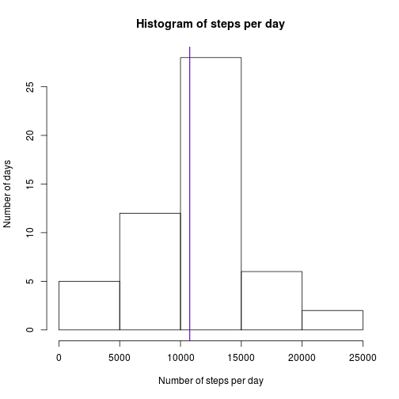
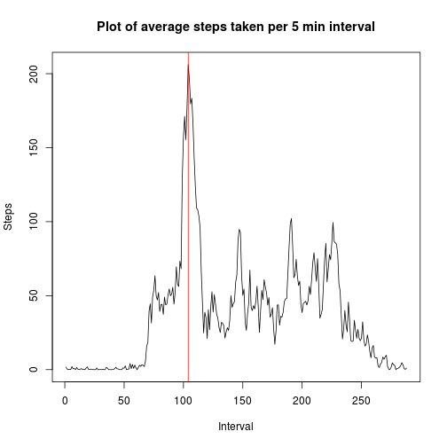
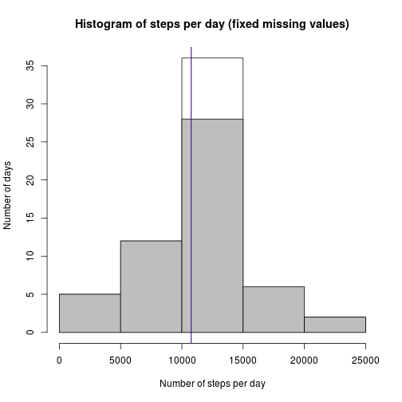
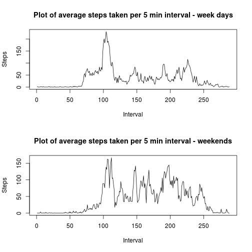

Loading libraries
=================

```r
library(dplyr)
```

Loading and preparing data
==========================
The following code loads the activity data into a dataframe.


```r
activity <- read.csv("activity.csv", header=TRUE)
```


Number of steps per day
=======================
First remove all NAs.  Group by date and sum.

```r
activity_nonas <- activity[!is.na(activity$steps), ]
activity_nonas_by_date <- group_by(activity_nonas, date)
steps_nonas_by_day <- summarise(activity_nonas_by_date, steps=sum(steps))
```

The mean and median of steps per day are calculated as follows:

```r
mean_nonas_by_date <- mean(steps_nonas_by_day$steps)
median_nonas_by_date <- median(steps_nonas_by_day$steps)
```

The following produces a histogram of the frequency of days, given the number of steps.  The mean 1.0766189 &times; 10<sup>4</sup> and median 10765 are shown (but they are too close and look like a single line)

```r
hist(steps_nonas_by_day$steps, ylab = "Number of days", xlab = "Number of steps per day", main = "Histogram of steps per day")
abline(col="red", v=mean_nonas_by_date)
abline(col="blue", v=median_nonas_by_date)
```



Average activity daily pattern
==============================
We now perform a group-by against intervals and compute the mean steps of each day:

```r
activity_nonas_by_interval <- group_by(activity_nonas, interval)
steps_nonas_by_interval <- summarise(activity_nonas_by_interval, steps=mean(steps))
```

Plotting:  Notice that the interval values look like numbers, but in reality they are time stamps (e.g., time 20:15 is written 2015).  We avoid using the wrong x-axis, by dropping the interval values and using numbers from 1 to the number of the intervals.  Interval number 47 is on average the most active one in the day (also shown in the plot).

```r
plot(1:length(steps_nonas_by_interval$steps), steps_nonas_by_interval$steps, type = "l", main = "Plot of average steps taken per 5 min interval", xlab = "Interval", ylab = "Steps")
abline(v=which.max(steps_nonas_by_interval$steps), col="red")
```



Imputing missing values
=======================
Out of a total of 17568 observations, 2304 are missing.  This is the 0.1311475 of the total observations.

We will substitute each missing observation with the corresponding average for its particular interval.  The following loop does the trick:

```r
activity_fixed <- activity
for(i in 1:nrow(activity)) { #for every row in the original table
    if (is.na(activity[i,][[1]])) { # is the steps observation missing?
        intv <- activity[i,][[3]] # let intv be the corresponding interval (in the original notation, e.g. 1255)
        m <- steps_nonas_by_interval[steps_nonas_by_interval$interval == intv,][[2]] # find the corresponding interval in table steps_nonas_by_day and get the corresponding median
        activity_fixed[i,][[1]] <- m  # fix the missing observation
    }
}
```

Now we can repeat the same histogram on the fixed table:

```r
activity_fixed_by_date <- group_by(activity_fixed, date)
steps_fixed_by_day <- summarise(activity_fixed_by_date, steps=sum(steps))
hist(steps_fixed_by_day$steps, ylab = "Number of days", xlab = "Number of steps per day", main = "Histogram of steps per day (fixed missing values)")
hist(steps_nonas_by_day$steps, col = "grey", add = TRUE)

mean_fixed_by_date <- mean(steps_fixed_by_day$steps)
median_fixed_by_date <- median(steps_fixed_by_day$steps)
abline(col="red", v=mean_fixed_by_date)
abline(col="blue", v=median_fixed_by_date)
```



We also see the old histogram in grey.  Nothing substantial has changed, since our strategy for replacing missing observations does not affects medians.

Some new observations are added and they all happen to be between 10000 and 15000.  This is not surprising either: if we look at the data set, we will notice that a day is either fully missing or fully observed (therefore all the missing days were converted to days with the mean number of steps).

Differences in activity patterns between weekdays and weekends
==============================================================

A new logical column is added to the fixed activity data set, which is true iff the row date belongs to a weekend:

```r
activity_fixed <- mutate(activity_fixed, isWeekend = weekdays(as.Date(activity_fixed$date, "%Y-%m-%d")) %in% c("Saturday", "Sunday"))
```

For the plot we want to make, we calculate the same data as before:

```r
activity_fixed_by_interval <- group_by(activity_fixed, interval, isWeekend)
steps_fixed_by_interval <- summarise(activity_fixed_by_interval, steps=mean(steps))
```

But now we make two plots, partitioning on the new column:

```r
steps_Weekend <- steps_fixed_by_interval[steps_fixed_by_interval$isWeekend, ]
steps_Weekday <- steps_fixed_by_interval[!steps_fixed_by_interval$isWeekend, ]
par(mfrow = c(2,1))
plot(1:length(steps_Weekday$steps), steps_Weekday$steps, type = "l", main = "Plot of average steps taken per 5 min interval - week days", xlab = "Interval", ylab = "Steps")
plot(1:length(steps_Weekend$steps), steps_Weekend$steps, type = "l", main = "Plot of average steps taken per 5 min interval - weekends", xlab = "Interval", ylab = "Steps")
```



There is a difference here.  Apparently, the subject wakes up later and goes to sleep later on weekends.  The maximum activity is also reduced, but there are more spikes.  Perhaps the subject has an office job, to which they walk.
